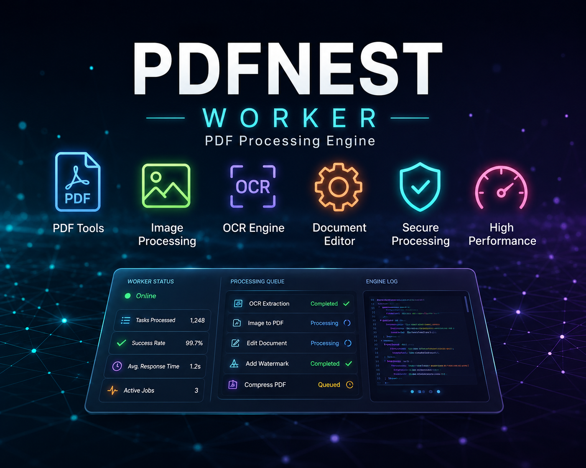

# PDFNest Worker

PDFNest Worker is the FastAPI processing service behind PDFNest. It handles the heavier document operations that the Go backend delegates over HTTP, including PDF analysis, metadata read/write, redaction, signing, editor extraction/compile flows, and markup jobs. The worker app mounts its routers from `app/main.py` and exposes health endpoints for readiness and uptime checks. fileciteturn29file0L22-L45 fileciteturn29file0L63-L111

## What it does

The worker is responsible for:

- analyzing PDF structure and page content
- reading and updating PDF metadata
- securely redacting text and selected regions
- signing PDFs with image stamps
- extracting and compiling editor layouts
- highlighting, underlining, and strikeouting document selections
- serving job status and download endpoints for job-based workflows

The current code base includes dedicated tool packages for analyzer, editor, markup, metadata, redact, and sign. fileciteturn29file2L297-L324 fileciteturn29file4L418-L479 fileciteturn29file9L1084-L1241

## Architecture

The worker is a FastAPI app. It loads CORS settings from environment variables, starts with a lifespan hook, and registers routers for jobs plus the tool packages. It also exposes `/`, `/health`, `/health/live`, and `/health/ready`. fileciteturn29file0L56-L111

The project still uses Dramatiq and Redis for queue-backed tools such as editor and markup, while analyzer, metadata, redact, and sign are synchronous HTTP endpoints. The worker settings include `REDIS_URL`, `HOST`, `PORT`, `APP_ENV`, and `APP_VERSION`. fileciteturn29file7L865-L889 fileciteturn29file8L944-L980 fileciteturn29file0L46-L75

## Tech stack

- Python 3.12
- FastAPI
- Uvicorn
- Dramatiq
- Redis
- PyMuPDF
- Pydantic
- Pillow
- pytesseract
- psutil
- camelot
- pdfplumber
- pandas
- python-pptx
- pdf2docx

The package manifest shows these core dependencies in `pyproject.toml`. fileciteturn29file5L636-L662

## Prerequisites

Install Python 3.12 and the native tools used by the worker workflows.

```bash
python --version
tesseract --version
```

On Ubuntu/Debian, the included install script installs common runtime packages such as LibreOffice, Ghostscript, Poppler utilities, Tesseract, and ffmpeg. fileciteturn29file5L573-L613

## Environment variables

The worker uses these common environment values:

- `APP_VERSION`
- `APP_ENV`
- `HOST`
- `PORT`
- `REDIS_URL`
- `ALLOWED_ORIGINS`

An example environment file is provided with those values. fileciteturn28file0L21-L28

## Getting started

Install dependencies:

```bash
uv sync
```

Run the worker in development:

```bash
bash run_dev.sh
```

Or start it manually:

```bash
uv run uvicorn app.main:app --reload
uv run dramatiq app.jobs.actors
```

The provided scripts run FastAPI and Dramatiq together. fileciteturn29file8L949-L989 fileciteturn29file7L865-L897

## Project structure

```text
app/
├── main.py
├── core/
├── jobs/
└── api/
    └── tools/
        ├── analyzer/
        ├── editor/
        ├── markup/
        ├── metadata/
        ├── redact/
        ├── sign/
        └── pdf_to_office/
```

The visible project tree confirms these tool packages and the worker entrypoint. fileciteturn29file2L299-L324 fileciteturn29file0L22-L45

## API overview

All tool endpoints accept `multipart/form-data` uploads.

### Health

- `GET /health`
- `GET /health/live`
- `GET /health/ready`

### Analyzer

- `POST /api/v1/analyzer/analyze`

Reads page structure and text/image statistics for a PDF. fileciteturn29file6L751-L803

### Metadata

- `POST /api/v1/metadata/read`
- `POST /api/v1/metadata/write`

Reads or updates title, author, subject, and keywords. fileciteturn29file0L1382-L1503

### Redact

- `POST /api/v1/redact`

Applies keyword and drawn-box redactions, then returns the redacted PDF. fileciteturn29file9L1089-L1241

### Sign

- `POST /api/v1/sign`

Overlays signature images on the requested page positions and returns the signed PDF. fileciteturn29file4L418-L479

### Editor

- `POST /api/v1/editor/extract`
- `POST /api/v1/editor/compile`
- `GET /api/v1/editor/jobs/:job_id`
- `GET /api/v1/editor/jobs/:job_id/download`

The editor flow uses jobs, payload files, and download endpoints. fileciteturn29file0L700-L829

### Markup

- `POST /api/v1/markup/highlight`
- `POST /api/v1/markup/underline`
- `POST /api/v1/markup/strikeout`
- `GET /api/v1/markup/jobs/:job_id`
- `GET /api/v1/markup/jobs/:job_id/download`

Markup uses job submission plus status/download endpoints. fileciteturn29file4L1189-L1261

## Notes

- The worker reads input PDFs into temporary files and cleans them up after each request.
- Some workflows are synchronous and return the final PDF immediately.
- Some workflows are asynchronous and use Redis-backed jobs through Dramatiq.
- The worker is meant to be called by the Go backend, not by the frontend directly.

## License

This project is licensed under the terms in [LICENSE](./LICENSE).


