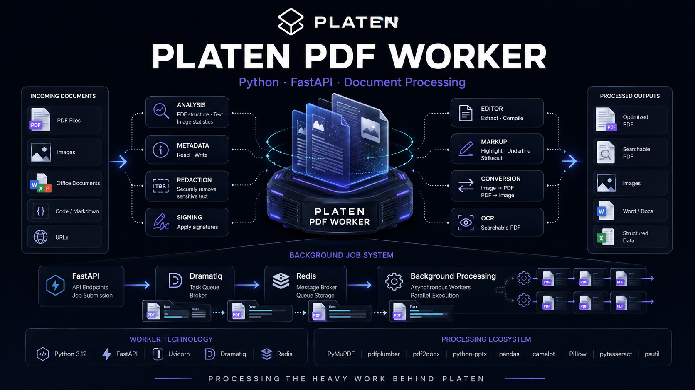

# Platen PDF Worker

## Overview

Platen PDF Worker is the FastAPI processing service behind the Platen PDF platform. It handles the heavier PDF operations delegated by the Platen PDF Backend, including analysis, metadata read/write, redaction, signing, editor extraction/compile flows, and markup jobs.

## Features

- **Analysis**: Extract page structure and text/image statistics.
- **Metadata**: Read and update PDF metadata fields.
- **Redaction**: Securely black out sensitive text.
- **Signing**: Apply signature images to PDFs.
- **Editor**: Extract and compile editor layouts.
- **Markup**: Highlight, underline, and strikeout selections with asynchronous job handling.
- **Conversion**: Image → PDF, PDF → image, OCR to searchable PDF.

## Tech Stack

- Python 3.12
- FastAPI
- Uvicorn
- Dramatiq + Redis (background job queue)
- PyMuPDF, pdfplumber, pdf2docx, python-pptx, pandas, camelot, Pillow, pytesseract, psutil

## Prerequisites

```bash
python --version

tesseract --version
```

On Ubuntu/Debian the included install script sets up required runtime packages:

```bash
sudo apt update
sudo apt install ghostscript tesseract-ocr libreoffice ffmpeg poppler-utils
```

## Getting Started

```bash
# Install dependencies
uv sync

# Run in development
bash run_dev.sh
# or manually
uv run uvicorn app.main:app --reload
uv run dramatiq app.jobs.actors
```

The worker exposes health endpoints at `/health`, `/health/live`, and `/health/ready`.

## Environment Variables

- `APP_VERSION`
- `APP_ENV`
- `HOST`
- `PORT`
- `REDIS_URL`
- `ALLOWED_ORIGINS`

## Project Structure

```text
app/
├── main.py               # FastAPI entry point
├── core/                 # Core utilities and config
├── jobs/                 # Dramatiq job definitions
└── api/tools/            # Tool routers (analyzer, editor, markup, etc.)
```

## API Overview

All tool endpoints accept `multipart/form-data`.

### Health

- `GET /health`
- `GET /health/live`
- `GET /health/ready`

### Analyzer

- `POST /api/v1/analyzer/analyze` – Analyze PDF structure and statistics.

### Metadata

- `POST /api/v1/metadata/read`
- `POST /api/v1/metadata/write`

### Redact

- `POST /api/v1/redact`

### Sign

- `POST /api/v1/sign`

### Editor

- `POST /api/v1/editor/extract`
- `POST /api/v1/editor/compile`
- `GET /api/v1/editor/jobs/:job_id`
- `GET /api/v1/editor/jobs/:job_id/download`

### Markup

- `POST /api/v1/markup/highlight`
- `POST /api/v1/markup/underline`
- `POST /api/v1/markup/strikeout`
- `GET /api/v1/markup/jobs/:job_id`
- `GET /api/v1/markup/jobs/:job_id/download`

## Notes

- The worker is intended to be called by the Platen PDF Backend, not directly by the frontend.
- Temporary files are cleaned up after each request.
- Some workflows are synchronous; others use Redis‑backed jobs via Dramatiq.

## License

This project is licensed under the terms in [LICENSE](./LICENSE).
